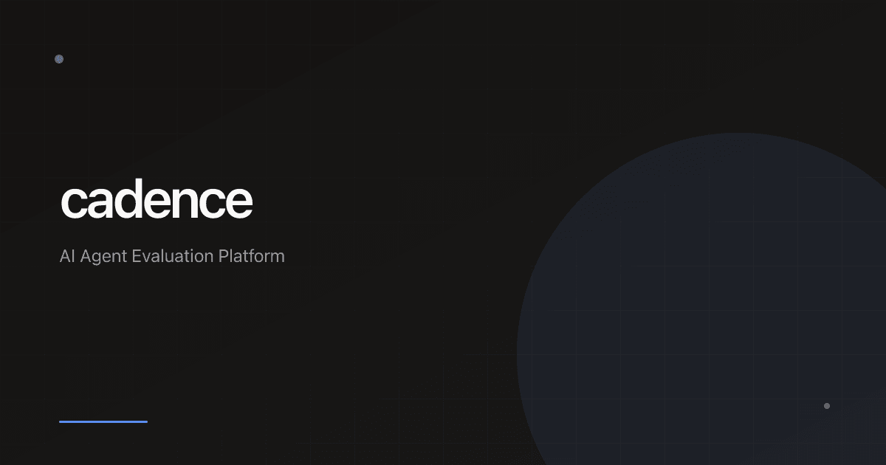

<h1 align="center">Cadence</h1>

<p align="center">
  <a href="https://nextjs.org/"></a>
  <a href="https://react.dev/"></a>
  <a href="https://typescriptlang.org/"></a>
  <a href="https://tailwindcss.com/"></a>
  <a href="https://neon.tech/"></a>
  <a href="https://trigger.dev/"></a>
  <a href="https://clerk.com/"></a>
</p>

<p align="center">
  Epoch-based AI agent prompt optimization
  <br />
  <br />
  <a href="https://cadence.crafter.run">Website</a>
  ·
  <a href="https://github.com/crafter-station/cadence/issues">Issues</a>
  ·
  <a href="https://crafters.chat">Community</a>
</p>

## What is Cadence?

Cadence is an automated prompt optimization platform that iteratively improves AI agent prompts through epoch-based evaluation cycles. Each epoch tests a prompt version against synthetic user personas, measures performance metrics (accuracy, conversion, latency), and uses AI to generate improved versions.

### Key Features

- **Epoch-Based Optimization** - Automated iterative improvement cycles with configurable stopping criteria
- **Synthetic Personas** - Test against diverse user personalities with customizable traits
- **Real-Time Monitoring** - Watch sessions execute in parallel with live transcript updates
- **Prompt Versioning** - Full version control with diff views and performance metrics per version
- **Conversion Tracking** - Define and track custom conversion goals (schedule demo, collect email, etc.)
- **Session Replay** - Reproduce and analyze any test session for debugging

## Quick Start

```bash
# Install dependencies
pnpm install

# Set up environment variables
cp .env.example .env.local

# Push database schema
pnpm db:push

# Seed initial data
pnpm db:seed

# Start development server
pnpm dev

# In another terminal, start Trigger.dev
bunx trigger.dev@latest dev
```

## Tech Stack

- **Framework**: Next.js 16 (App Router)
- **Language**: TypeScript 5
- **Styling**: Tailwind CSS 4
- **Database**: Neon (Serverless Postgres) + Drizzle ORM
- **Auth**: Clerk
- **Background Jobs**: Trigger.dev
- **AI**: Vercel AI SDK (Anthropic Claude)
- **UI**: Radix UI + shadcn/ui

## Project Structure

```
src/
├── app/                 # Next.js App Router pages
│   └── app/            # Dashboard pages
├── components/         # React components
├── db/                 # Database schema and queries
├── actions/            # Server actions
├── hooks/              # React Query hooks
├── lib/                # Utilities and AI functions
└── trigger/            # Background job tasks
```

## License

MIT
